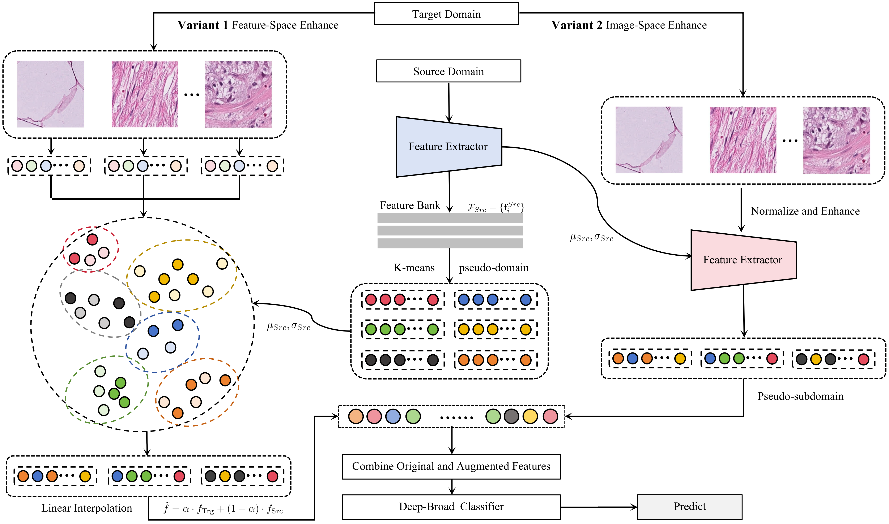
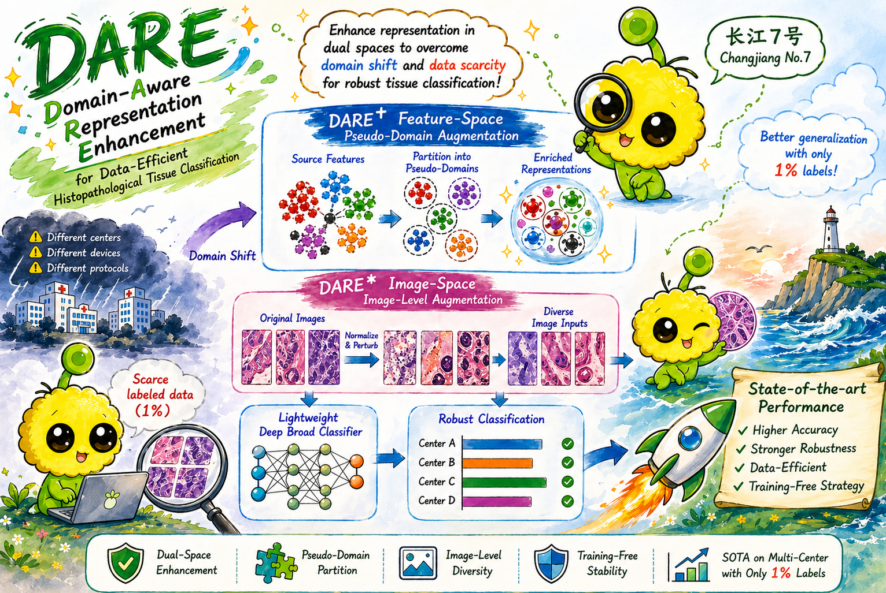

# DARE: Domain-Aware Representation Enhancement for Data-Efficient Histopathological Tissue Classification


This is the official implementation of the paper: "DARE: Domain-Aware Representation Enhancement for Data-Efficient Histopathological Tissue Classification". We propose DARE, a two-separated-methods framework for robust tissue classification. It integrates two data augmentation strategies within an advanced lightweight deep broad learning system for targeted domain adaptation.

## Framework Overview



## Abstract



## Highlights

- A DARE includes two separate methods is proposed for robust tissue classification.
- DARE† is a pseudo-domain partition strategy to enrich feature-space variability.
- DARE* is an image-level scheme to enhance robustness via input-space diversity.
- A training-free strategy ensures stable optimization in small-sample regimes.
- Significant gains are achieved on multi-center data using only 1% labeled samples

## Project Structure

The repository is organized as follows:
```
├── dataset/             # (Placeholder) Create this folder for your data
├── save/                # Output directory for weights and PCA models
├── tool/                # Core logic & utilities
│   ├── PDBL.py          # PDBL classifier implementation
│   ├── dataset.py       # Data loading utilities
│   ├── resnet.py        # ResNet backbone definition
│   ├── shufflenet.py    # ShuffleNet backbone definition
│   ├── eff.py           # EfficientNet backbone definition
│   ├── pdbl_head.py     # PDBL head components
│   └── utils.py         # Helper functions
├── main.py              # Main script for DARE ablation study
├── pdbl_swin_tiny_model.py # Swin-Tiny triple-branch model definition
├── pdbl_shufflenet_model.py # Shufflenet triple-branch model definition
├── pdbl_resnet50_model.py # Resnet triple-branch model definition
├── pdbl_eff_model.py # Effnet triple-branch model definition
├── export_weights.py    # Weight compression and export script
├── requirements.txt     # Dependencies
└── README.md
```

## Environment

Ensure you have Python 3.8+ installed. We recommend using a virtual environment.
```

OS: Linux, Windows, or macOS

Python: 3.8 or higher

Core Libraries:

torch >= 2.0.0

torchvision

timm

scikit-learn

joblib

tqdm

Pillow

Install all dependencies via:

pip install -r requirements.txt
```


## Datasets

We evaluate DARE using subsets of the Kather Multiclass Dataset.

- **Source Domain (KME):** Kather Multiclass External subset.

- **Target Domain (Kather001):** Kather001 subset.

Please download the datasets from [Zenodo](https://zenodo.org/record/1214456) or the official [Kather Laboratory](https://jnkather.github.io/) website. Organize them into the dataset/ folder. Note that the 'Background' (BACK) class is removed for consistent 8-class classification.

## Data Format

The project expects images to be organized in the standard ImageFolder format.
```
dataset/
├── KME/ (Source Domain)
│   ├── ADI/
│   │   ├── img1.png
│   │   └── ...
│   ├── DEB/
│   ├── LYM/
│   └── ... (Total 9 classes)
└── Kather001/ (Target Domain)
    ├── ADI/
    ├── DEB/
    └── ... (Same 9 classes)

```

## Installation

1. Clone the repository:
```
git clone [https://github.com/AndyRong921/DARE.git](https://github.com/AndyRong921/DARE.git)
cd DARE
```

2. Install dependencies:
   
```
pip install -r requirements.txt
```

## Usage

The DARE framework follows a two-step workflow: first extracting source features to initialize the model, then performing domain adaptation on the target set.

**Step 1: Feature Extraction & Model Initialization**

Use the model-specific script (e.g., pdbl_swin_tiny_model.py) to extract multi-scale features from the source domain, fit the PCA reduction model, and train the initial PDBL classifier.

### Example for Swin-Tiny backbone
```
python pdbl_swin_tiny_model.py --source_dir dataset/KME --save_dir save --n_class 8
```

This step will generate the following artifacts in the save/ directory:

```PCA_swin.pkl: ```The trained PCA dimensionality reduction model.

```PDBL_swin.npy:``` The analytical weights for the PDBL classifier.

**Step 2: Running DARE Ablation & Evaluation**

After obtaining the source domain statistics and weights, run the main ablation script to evaluate DARE*, DARE†, and Voting strategies on the target domain.
```
# Run ablation study on target domain
python main.py --backbone swin --source_dir dataset/KME --target_dir dataset/Kather001 --n_clients 4
```

**Optional: Weight Compression**

To compress existing weights for efficient deployment:
```
python export_weights.py
```


## Methodology

- **Multi-Scale Backbone:** Uses a pyramidal topology to capture hierarchical morphology across different image resolutions (224, 160, 112).

- **DARE Mechanism:**

  (i)  DARE*: Applies stochastic normalization using a pool of statistics sampled from the source domain to simulate domain shifts.

  (ii) DARE†: Partitions the source data into pseudo-domains via K-means clustering to perform cross-domain interpolation.

- **Inference-time Voting:** Aggregates predictions across multiple stochastic realizations ($K=8$) to ensure decision stability.

## Acknowledgment

The PDBL classifier implementation in this project is based on the original work by Lin et al.: [PDBL: Improving Histopathological Tissue Classification with Plug-and-Play Pyramidal Deep-Broad Learning](https://github.com/linjiatai/PDBL)

## Citation

If you find this research useful, please cite our paper:
```
@article{rong2026dare,
  title={DARE: Domain-Aware Representation Enhancement for Data-Efficient Histopathological Tissue Classification},
  author={Rong, Zhijin and Zeng, Xueying and Zhang, Jingliang and Zhang, Qing},
  year={2026},
  note={Under review}
}
```
